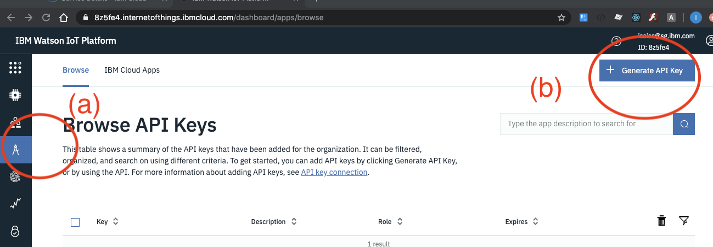
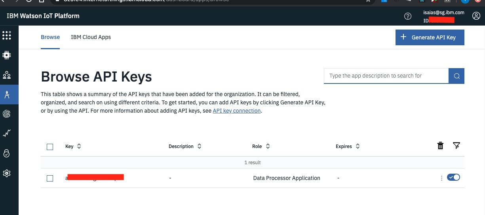
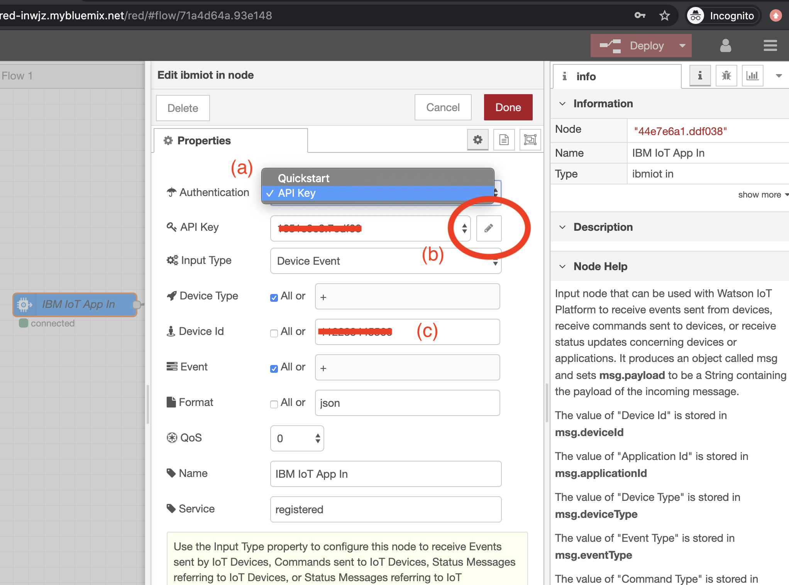
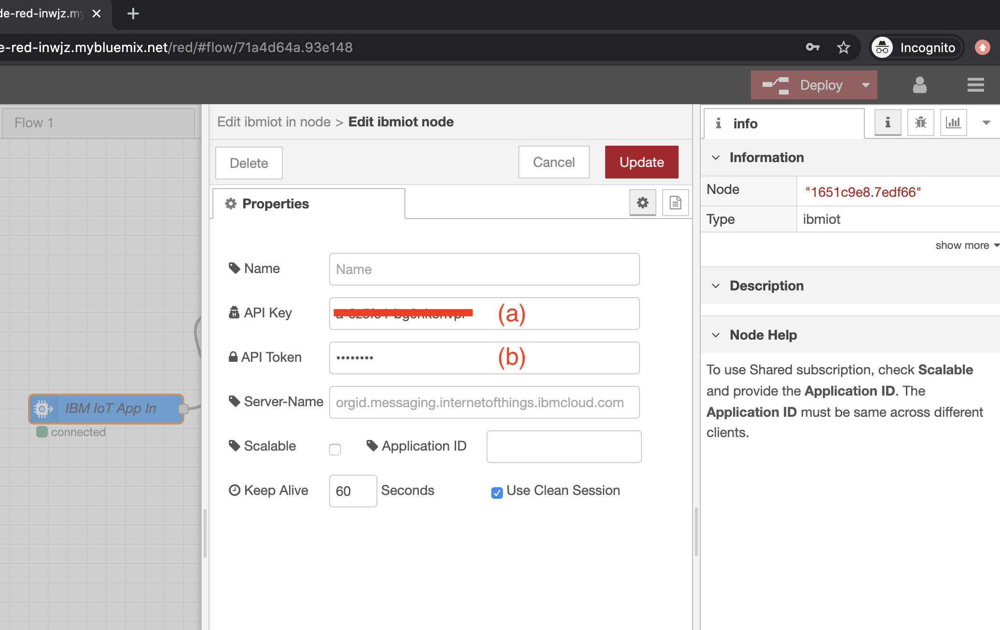
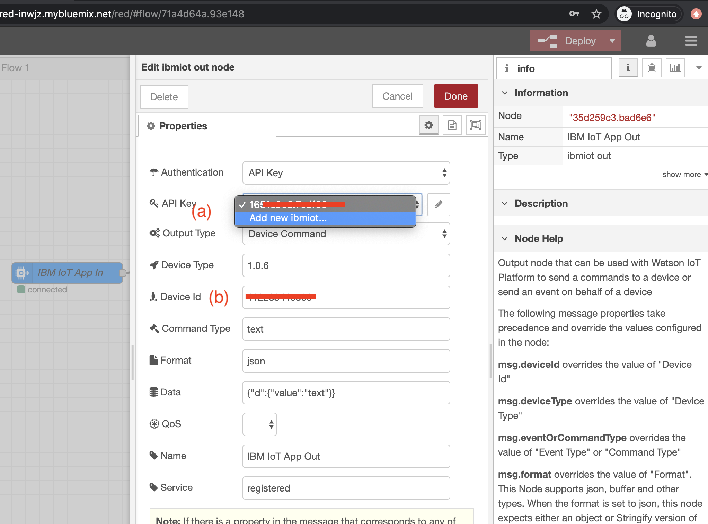

# Setting up your first IoT

#### Create IBM Cloud apps to process, visualize, and store sensor data that is sent to and from your smartphone

* Proceed to this tutorial, [Turn your smartphone into an IoT device](https://developer.ibm.com/technologies/iot/tutorials/iot-mobile-phone-iot-device-bluemix-apps-trs/)

* For latest release of the IoT Starter Android App, download from this Github [repository](https://github.com/IraAngeles-IBM/iot-starter-for-android/releases)

* If you encounter any issues in Step 5. Please continue with the following to generate the API key:

    * In **IBM Watson IoT Platform** dashboard, select Apps (a), then **Generate API Key** (b). Kindly save the generated API key and Authentication token.  Once lost you need to generate again.

    

    * You will then see the following after the API key is generated

    

    * Select the **IBM IoT App In** node, in Authentication (a) select API Key. Then In the API Key, click on the pen (b), to create a new API key.  Then enter the Device Id (c).

    

    * Next enter the API Key (a) and API token (b) saved earlier. Click update and Deploy to save the settings.

    

    * Select the **IBM IoT App Out** node, in the Authentication, select API Key, then in the API Key select the previously created API Key in **IBM IoT App In** node. Then key in the **Device Id** (b). Click update and Deploy to save the settings.

    

