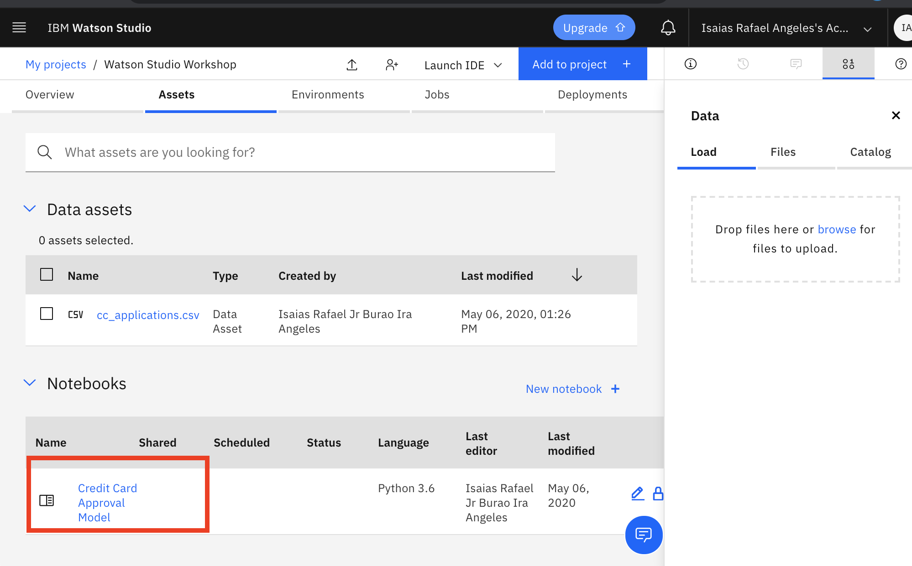
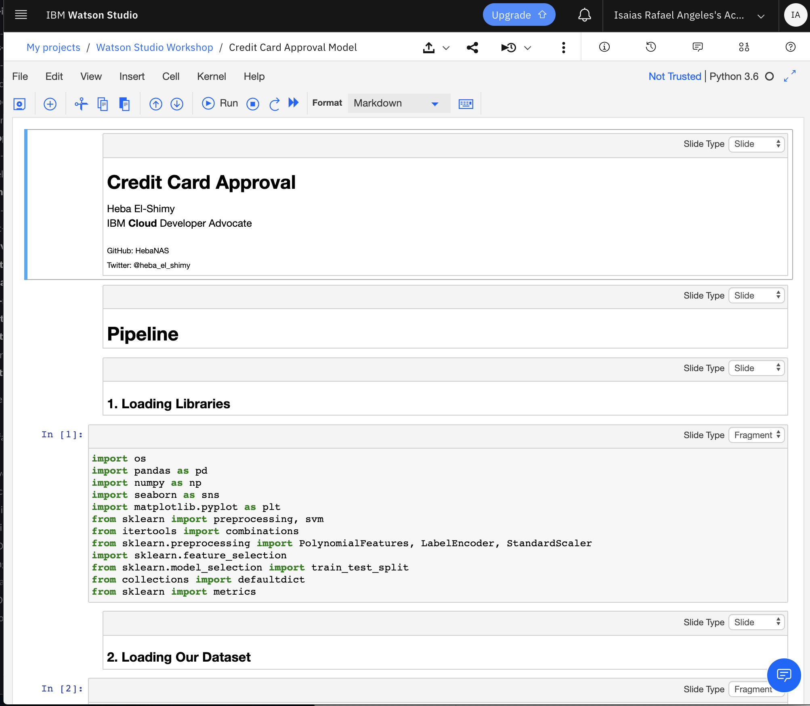
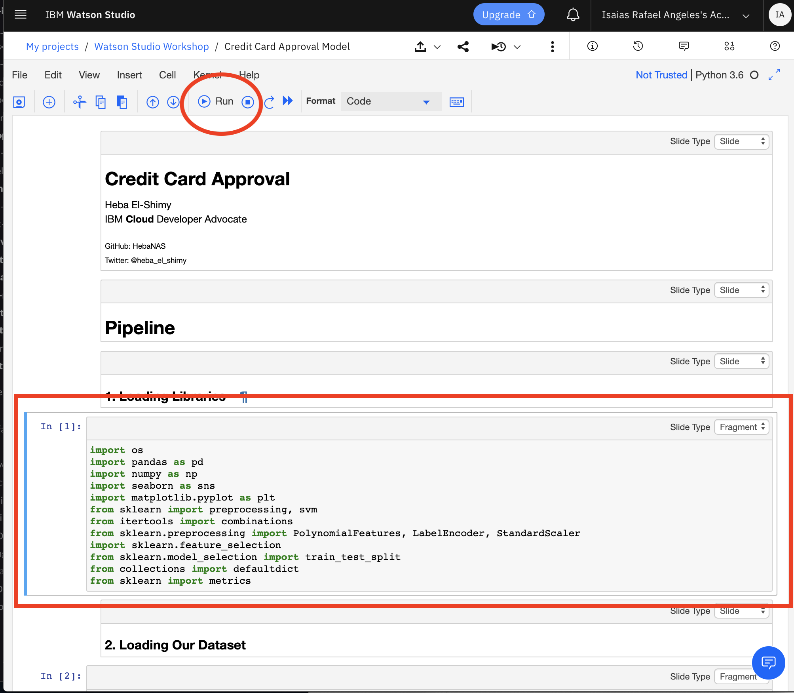
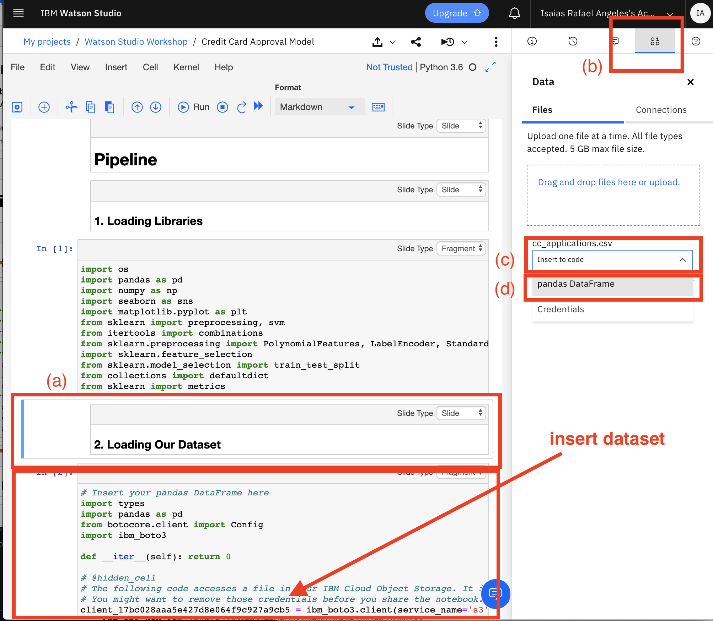
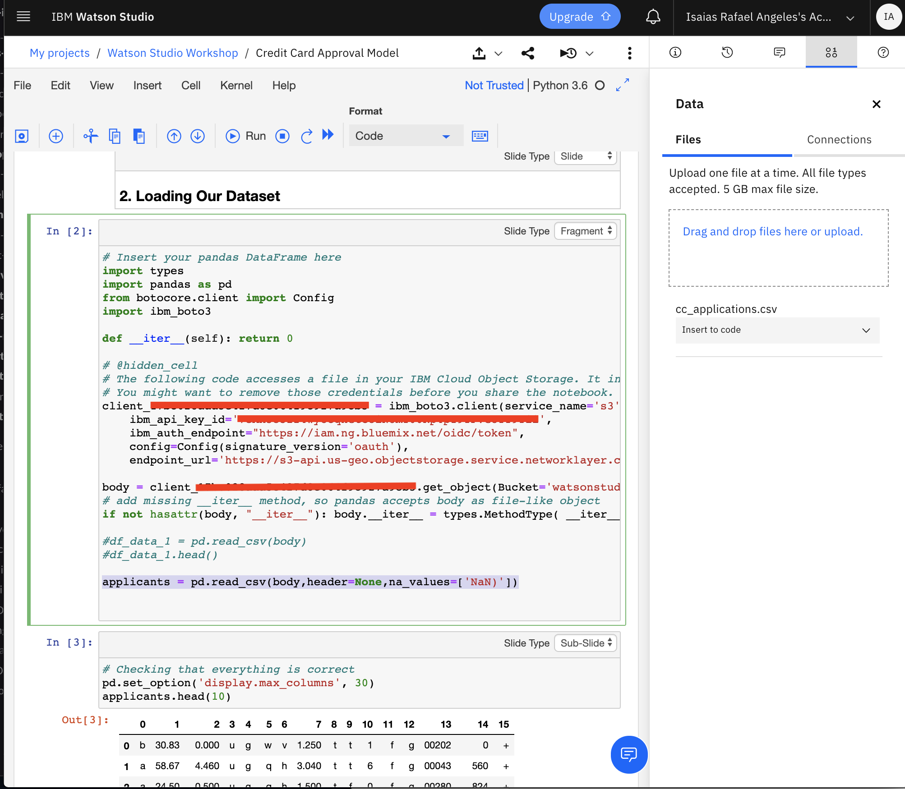
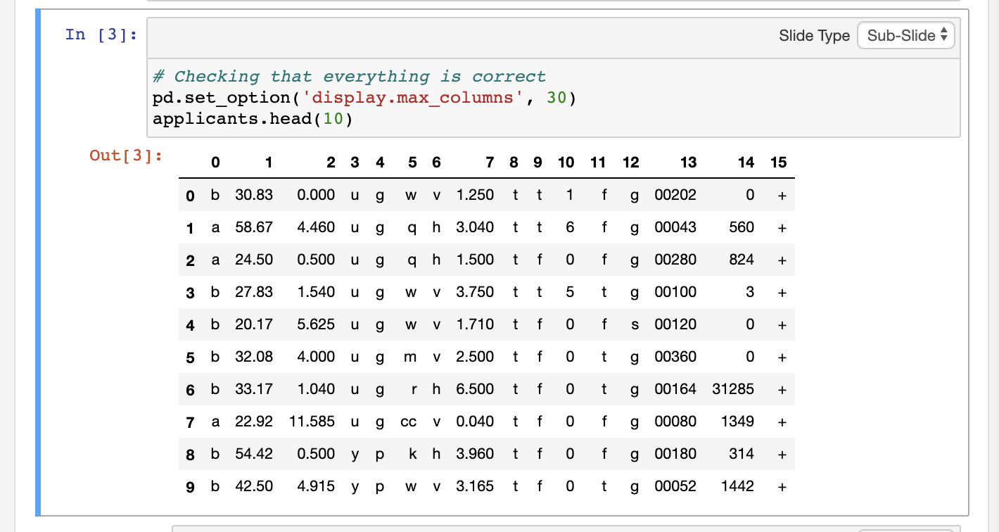
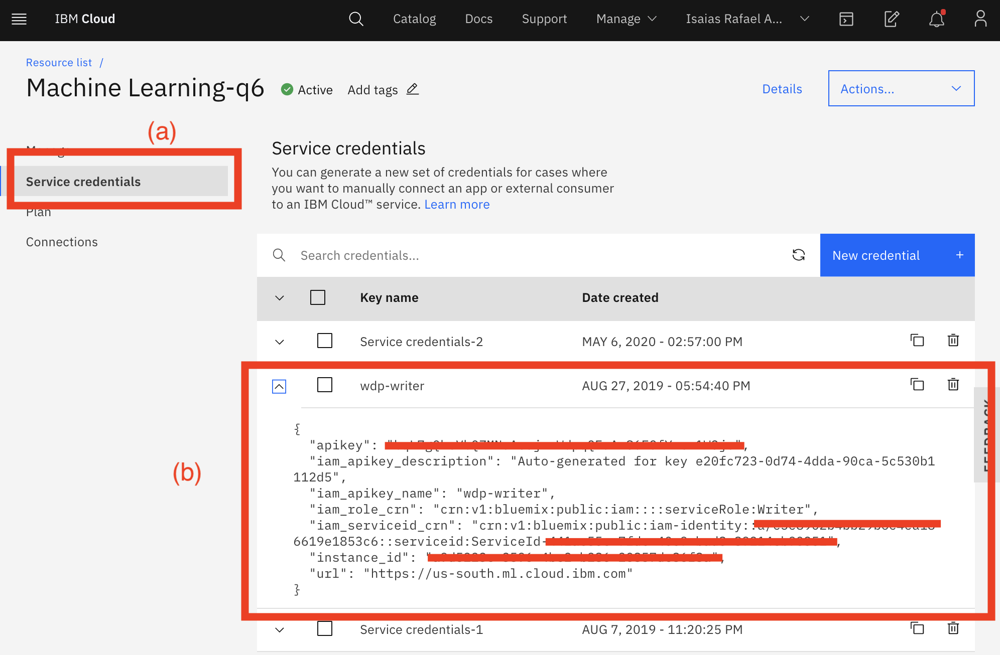
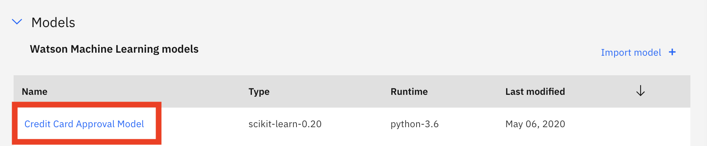
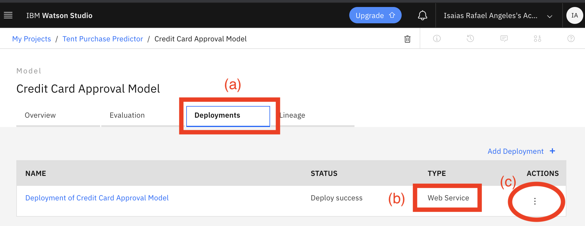
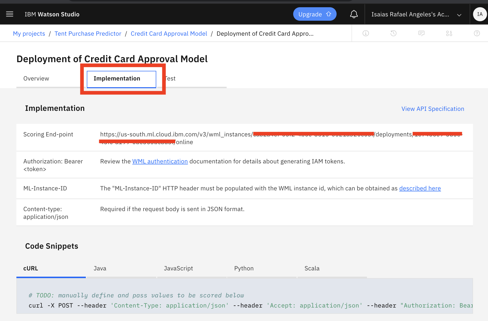

# Jupyter Notebook - Credit Card Approval Model

In this tutorial, you will be using Machine Learning and Jupyter Notebook using Watson Sutdio.

## Steps

1. Create Project in Watson Studio if you have not done so.

    

2. Download data file [cc_applications.csv](https://gist.github.com/IraAngeles-IBM/ea680e80b7ddcabd98d334475c87255a)

3. Click on the **Find and Add Data** button (a), then upload the data file to the drop box (b). The uploaded data file will then appear in the Data Assets (c).

    

4. Download notebook file [Credit Card Approval Model .ipynb](https://gist.github.com/IraAngeles-IBM/ea680e80b7ddcabd98d334475c87255a) and **add to the project**, select **Notebok** (a).  

    )

5. Select **From file**.  Either browse directories or drag and drop to the box.  The file will then be added to the project Assets.

    

6. Click on the **Credit Card Approval Model** to edit

    

7. You can now access the notebook and start with the exercise. We will be using Python 3.6. Click on the **pen** icon to edit the file.

    

8. To start select the first cell and click on the **Run** button to execute the code. The cell being executed is highlighted. 

    

9. Then go to the cell of **2. Loading Our Dataset** (a), select the **Add Data icon** (b), click on the drop down **Insert to code** (c), then select **pandas DataFrame** (d)

    

10. In the added code replace the following

    ``` 
        df_data_1 = pd.read_csv(body)
        df_data_1.head()
    ```
    by
    ```
    applicants = pd.read_csv(body,header=None,na_values=['NaN)'])
    ```

    

11. In the current cell, click on the **Run** button and should the the results.

    

12. You can go thru the code either **cell by cell** or  click on **Cell > Rull all below**.  The following are the sample results.

    

13. Now we can proceed to publish and deploy this model via (REST API).  Proceed to the cell with **Bonus: Deploy model on the cloud using IBM Watson Machine Learning.**. Then add the **wml_credentials** from IBM Cloud.  Refer to the next step how to get the credentials.

    

14. Get the wml credentials from IBM Cloud. Select the **Machine Learning** service, click on the **Service credentials** (a), then click on the **drop down** button, then copy the selected credentials (b).

    

15. Run the cell and should show the following results:

    

16. The above steps will create the Model and will be added to the Assets.

    

17. Click on the Credit Card Approval Model, then on the Deployments tab. You will see that the model has been successfully deployed as a web Service. Then click on (c) to proceed to the deployment.

    

18. Or Click on the **Deployment of Credit Card Approval Model**.  Click on the Implementation tab and select the appropriate Code Snippets for the desired language (cURL, Java, Javascript, Python, Scala).

    

## Conclusion

In this exercise, you experienced uploading a Notebook and data set in order to analyze credit card application data. You then published and deployed it as a web service.

